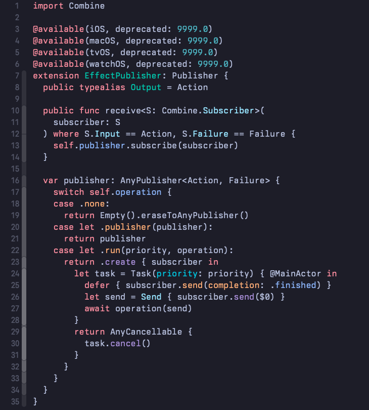
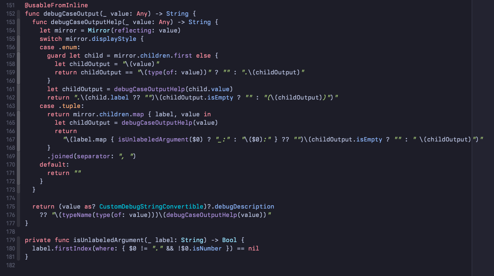

# TokyoNight Xcode Theme

This is my port of TokyoNight theme for Xcode, based on [folke/tokyonight.nvim](https://github.com/folke/tokyonight.nvim)

## How to install

1. Download or clone this repo
2. Move `tokyonight.xccolortheme` to `~/Library/Developer/Xcode/UserData/FontAndColorThemes`
3. Apply tokyonight theme from Xcode Preferences > Fonts & Colors (You might need to restart Xcode first)

## Screenshots

Font is [Berkeley Mono](https://berkeleygraphics.com/typefaces/berkeley-mono/)

